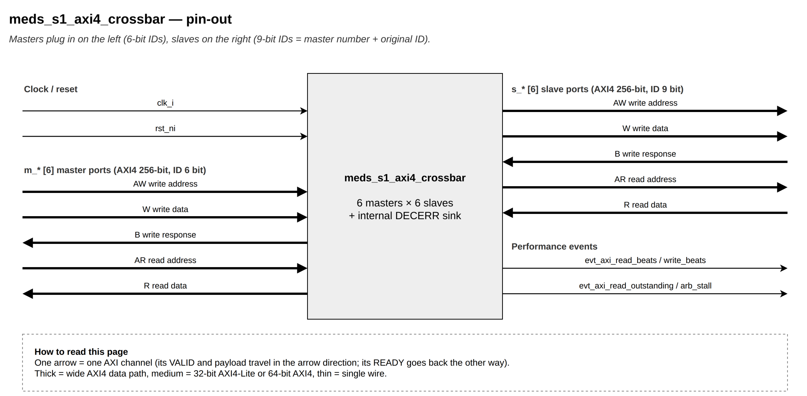

# `meds_s1_axi4_crossbar`

| | |
|---|---|
| **Status** | COMPLETE |
| **Owner** | @EmanMaqsood5 |
| **Backup** | _(assign)_ |
| **Project** | T-04 (fabric) — crossbar |
| **Spec** | SPEC §12 (perf events), §18, Figure 10 |
| **Source** | `rtl/fabric/meds_s1_axi4_crossbar.sv` |
| **Testbench** | `verif/unit/tb_meds_s1_axi4_crossbar.sv` |

## Purpose

The AXI4 backbone crossbar: `NUM_MASTERS` × `NUM_SLAVES`, 256-bit data, 40-bit address. Every
master reaches every slave; an unmapped address is routed to an internal DECERR sink, which the
crossbar treats as just one more slave (index `NUM_SLAVES`).

Four rules keep it AXI-correct:

1. **Decode only while VALID is high.** A miss goes to the internal DECERR sink. Responses are
   never routed from a master's current address bus after the handshake — only by the ID tag.
2. **A master may have up to `MAX_OUTSTANDING` writes (and, separately, reads) in flight, but all
   to the same slave.** So at most one slave can ever answer a given master: no two B (or R)
   responses can collide, and same-ID ordering is kept by that one slave.
3. **Each slave keeps a small FIFO of which master owns the next W burst**, in AW-acceptance
   order, so W data always follows AW order.
4. **The arbiters lock their grant while VALID && !READY**, so a slave never sees the AW/AR payload
   change before the handshake.

IDs: the master index is prepended (`AXI_SID_W = AXI_ID_W + MIDX_W`) on the way to a slave and
stripped on the way back.

## Interface contract

| Signal | Dir | Width | Meaning | Contract |
|---|---|---|---|---|
| `clk_i`, `rst_ni` | | 1 | clock, reset | async assert, sync de-assert |
| `m_*` | | | `NUM_MASTERS` AXI4 slave ports | 256-bit, `AXI_ID_W`-bit ID |
| `s_*` | | | `NUM_SLAVES` AXI4 master ports | 256-bit, `AXI_SID_W`-bit ID (master index prepended) |
| `evt_axi_read_beats_o`, `evt_axi_write_beats_o` | out | 4, 4 | beats accepted this cycle (real slaves only) | per-cycle increment, for `mhpmcounters` |
| `evt_axi_read_outstanding_o` | out | 6 | reads in flight this cycle | summed over time = read-latency-sum (Little's law) |
| `evt_axi_arb_stall_o` | out | 5 | AW/AR requests waiting on another master holding the slave | per-cycle increment |

**Handshake:** rule 4 above — a granted arbiter index is held stable until the slave accepts.
**Throughput:** up to one AW/AR grant and one W/B/R beat per slave per cycle; masters to different
slaves proceed independently.
**Reset state:** no grants, no outstanding counts, empty W-owner FIFOs.

## Parameters

None of its own; `NUM_MASTERS`, `NUM_SLAVES`, `AXI_ID_W`, `AXI_SID_W`, `MAX_OUTSTANDING`,
`OUT_CNT_W` all come from `meds_s1_axi4_pkg`. Internally: `NSI = NUM_SLAVES + 1` (the extra slot
is the DECERR sink) and a W-owner FIFO depth of 8 per slave.

## Behaviour

AW/AR: decode the address (`xbar_decode()`), check the per-master outstanding limit, request the
target slave's round-robin arbiter (`meds_s1_rr_arbiter`), and on grant prepend the master index to
the ID. AW acceptance also pushes that master's index into the target slave's W-owner FIFO.

W: each slave's data comes from whichever master is at the head of its W-owner FIFO (popped on
WLAST), so W always follows AW order even with multiple masters interleaved. B and R: routed back
to the requesting master purely by reading the top `MIDX_W` bits of the ID tag — no separate
routing table needed.

## Exceptions and errors

Any address `xbar_decode()` doesn't map to a real slave is routed to `meds_s1_axi4_decerr_sink`
(see that module's page), which returns DECERR.

## Verification status

| Layer | Status | Where |
|---|---|---|
| Lint | clean, all four configs (`make lint`) | |
| Unit test | 57 checks, 433 checked bursts across 6 concurrent masters | `verif/unit/tb_meds_s1_axi4_crossbar.sv` |
| Co-simulation | not applicable | |
| Formal | not yet | |

Six test groups: T1 decode of every Appendix-B region plus the 1 GB DRAM limit and DECERR bursts;
T2 masters that park their address bus at 0 right after the handshake (confirms routing never
re-reads a stale address bus); T3 one master with two outstanding accesses to different slaves; T4
one master with 4 outstanding accesses to the same slave (checks in-order B/R); T5 all 6 masters
running concurrently with random bursts and random stall/backpressure, every read checked
byte-by-byte against an independent scoreboard (433 bursts, 1933 write beats, 1943 read beats,
arb_stall seen under real contention); T6 performance-event counters cross-checked against what the
slave models actually saw. A handshake checker watches every slave AW/W/AR channel and every
master B/R channel throughout.

## Known limitations

None beyond the outstanding-transaction limit already described in rule 2.

## Open questions

None.
