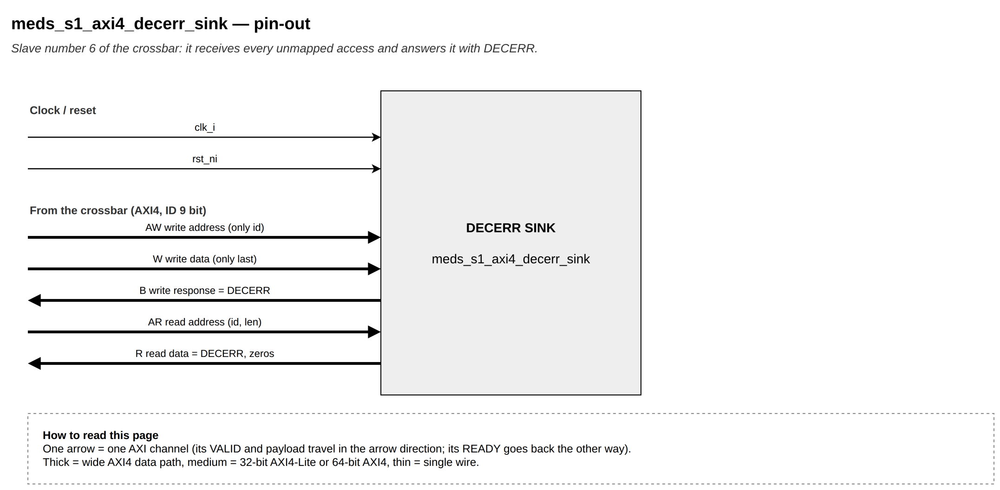

# `meds_s1_axi4_decerr_sink`

| | |
|---|---|
| **Status** | COMPLETE |
| **Owner** | @EmanMaqsood5 |
| **Backup** | _(assign)_ |
| **Project** | T-04 (fabric) — crossbar |
| **Spec** | SPEC §18, Figure 10 |
| **Source** | `rtl/fabric/meds_s1_axi4_decerr_sink.sv` |
| **Testbench** | covered end-to-end through `verif/unit/tb_meds_s1_axi4_crossbar.sv` |

## Purpose

The crossbar's "slave" for unmapped addresses — instantiated internally at slave index
`NUM_SLAVES` (see `meds_s1_axi4_crossbar.md`), so the crossbar routes a miss to it exactly like to
any real slave, with no special-casing elsewhere in the decode or routing logic. It is a normal
one-burst-at-a-time AXI4 slave: write accepts AW, drains every W beat up to WLAST, and returns one
DECERR B; read accepts AR and returns `ARLEN + 1` beats of zero data with DECERR, RLAST on the
final beat.

## Interface contract

| Signal | Dir | Width | Meaning | Contract |
|---|---|---|---|---|
| `clk_i`, `rst_ni` | | 1 | clock, reset | async assert, sync de-assert |
| `awid_i`, `awvalid_i` | in | `AXI_SID_W`, 1 | write address (only the ID matters) | |
| `awready_o` | out | 1 | | high only in the idle state |
| `wlast_i`, `wvalid_i` | in | 1, 1 | write data (only WLAST matters) | |
| `wready_o` | out | 1 | | high only while draining a burst |
| `bid_o`, `bresp_o`, `bvalid_o` | out | `AXI_SID_W`, 2, 1 | write response | `bresp_o` is always DECERR |
| `bready_i` | in | 1 | | |
| `arid_i`, `arlen_i`, `arvalid_i` | in | `AXI_SID_W`, 8, 1 | read address | |
| `arready_o` | out | 1 | | high only when idle |
| `rid_o`, `rdata_o`, `rresp_o`, `rlast_o`, `rvalid_o` | out | `AXI_SID_W`, 256, 2, 1, 1 | read data | `rdata_o` always zero, `rresp_o` always DECERR |
| `rready_i` | in | 1 | | |

**Handshake:** standard AXI4 — READY only asserted in the state that's actually ready to accept.
**Throughput:** one burst at a time per direction (matches every other slave behind this crossbar).
**Reset state:** idle on both sides.

## Parameters

None; all widths come from `meds_s1_axi4_pkg` (`AXI_SID_W`, `AXI_DATA_W`).

## Behaviour

Write: `W_IDLE` (capture the ID on AW) → `W_DRAIN` (accept and discard W beats until WLAST) →
`W_RESP` (hold DECERR B until accepted) → `W_IDLE`.

Read: `R_IDLE` (capture ID and beat count on AR) → busy, sending one DECERR beat per cycle READY
is seen, counting down from `ARLEN`, RLAST on the last one → `R_IDLE`.

## Exceptions and errors

Always DECERR — that is its entire purpose.

## Verification status

| Layer | Status | Where |
|---|---|---|
| Lint | clean, all four configs (`make lint`) | |
| Unit test | exercised through the crossbar's T1 group | `verif/unit/tb_meds_s1_axi4_crossbar.sv` |
| Co-simulation | not applicable | |
| Formal | not yet | |

Not tested in isolation; `tb_meds_s1_axi4_crossbar`'s T1 group checks every unmapped-address case
(past the 1 GB DRAM limit, past the DRAM alias, a hole in the memory map), including a 3-beat write
burst and a 4-beat read burst both landing entirely on this sink, confirming ID echo and beat
counting.

## Known limitations

One burst per direction at a time, same as every other slave.

## Open questions

None.
