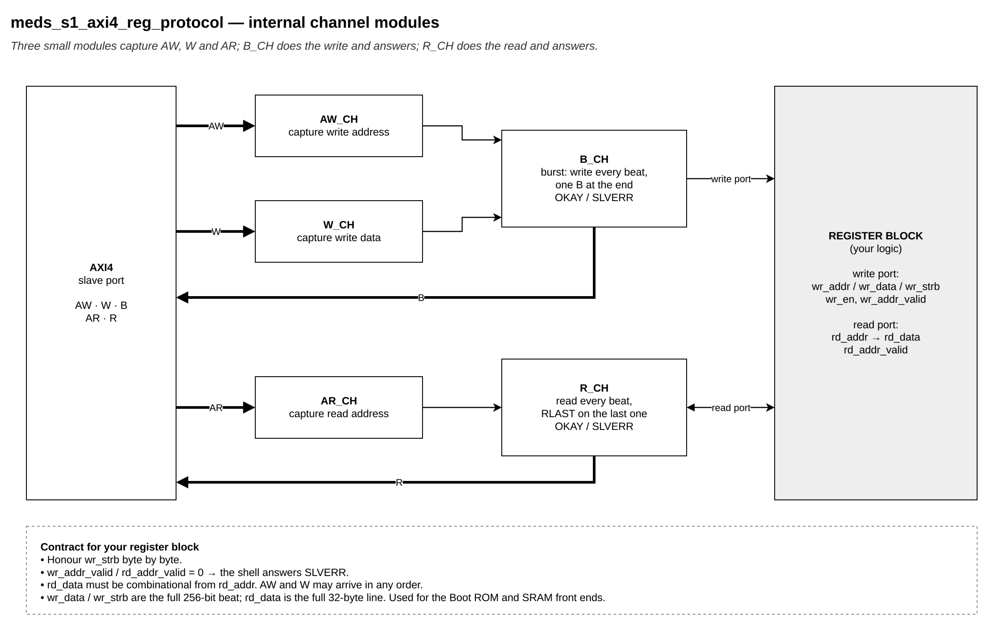
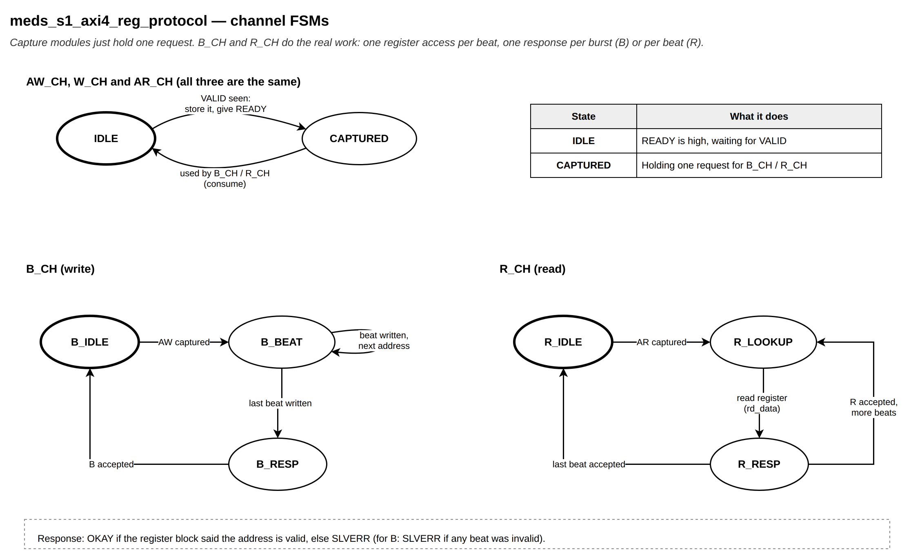

# `meds_s1_axi4_reg_protocol`

| | |
|---|---|
| **Status** | COMPLETE |
| **Owner** | @EmanMaqsood5 |
| **Backup** | _(assign)_ |
| **Project** | T-04 (fabric) — shared register shell |
| **Spec** | SPEC §18, §20.2, §24; AXI IHI0022 |
| **Source** | `rtl/common/meds_s1_axi4_reg_protocol.sv` |
| **Testbench** | `verif/unit/tb_meds_s1_axi4_reg_protocol.sv` |
## Purpose

A burst-capable full-AXI4 slave shell. Same idea as `meds_s1_axil_reg_protocol`, but on the
256-bit backbone: it accepts INCR, WRAP and FIXED bursts of 1..256 beats and turns each **beat**
into one register-port access, so the storage behind it never needs to know a burst is happening.
Intended for simple slaves on the backbone such as the Boot ROM and on-chip SRAM front ends.

Internally: `meds_s1_axi4_aw_ch`, `meds_s1_axi4_w_ch`, `meds_s1_axi4_ar_ch` capture requests;
`meds_s1_axi4_b_ch` sequences the write beats and answers one B; `meds_s1_axi4_r_ch` sequences the
read beats and answers one R per beat.

## Interface contract

| Signal | Dir | Width | Meaning | Contract |
|---|---|---|---|---|
| `clk_i` | in | 1 | clock | single domain |
| `rst_ni` | in | 1 | reset | async assert, sync de-assert |
| `aw*`, `w*`, `b*`, `ar*`, `r*` | | | AXI4 slave port | `ID_W`-bit ID, 40-bit address, 256-bit data |
| `wr_addr_o`, `wr_data_o`, `wr_strb_o` | out | 40, 256, 32 | write port | full beat on the AXI byte lanes of `wr_addr_o` |
| `wr_en_o` | out | 1 | write strobe | one pulse **per beat** |
| `wr_addr_valid_i` | in | 1 | address implemented? | 0 on any beat → the burst's B is SLVERR |
| `rd_addr_o` | out | 40 | read address of the current beat | |
| `rd_data_i`, `rd_addr_valid_i` | in | 256, 1 | read result | **combinational**; 0 → that beat is SLVERR |

**Handshake:** READY never waits for VALID. The ID is echoed unchanged on B and R.
**Throughput:** at best one write beat or one read beat every two cycles.
**Backpressure:** one write burst and one read burst at a time. The next AW can be captured while B
is waiting for BREADY.
**Reset state:** VALID outputs low; capture modules' READY high.

### Contract for the storage behind the shell

- `wr_data_o` / `wr_strb_o` are the full 256-bit beat; honour `wr_strb_o` per byte.
- `rd_data_i` must be combinational from `rd_addr_o` and on the AXI byte lanes for that address
  (a memory simply returns the whole 32-byte line containing `rd_addr_o`).
- Drive `wr_addr_valid_i` / `rd_addr_valid_i` low for an unimplemented address.

## Parameters

| Parameter | Default | Legal range | Effect |
|---|---|---|---|
| `ID_W` | `AXI_ID_W` (6) | 1..16 | set to `AXI_SID_W` (9) directly behind a crossbar slave port |

## Behaviour

B_CH: IDLE → BEAT when AW is captured; in BEAT, each captured W beat pulses `wr_en_o` and steps the
address with `axi_next_addr()`; after beat `AWLEN` → RESP → IDLE on BREADY. R_CH: IDLE → LOOKUP
(AR captured) → RESP (register data and per-beat response) → LOOKUP for the next beat, or IDLE
after the last beat (RLAST).

## Exceptions and errors

- B: SLVERR if **any** beat of the burst hit an invalid address (AXI has one response per burst).
- R: SLVERR per beat, as AXI4 requires.
- Never DECERR — decoding happens upstream.

## Verification status

| Layer | Status | Where |
|---|---|---|
| Lint | clean, all four configs (`make lint`) | |
| Unit test | 13457 checks | `verif/unit/tb_meds_s1_axi4_reg_protocol.sv` |
| Co-simulation | not applicable | |
| Formal | not yet | |

The testbench puts 4 KB of storage behind the shell and runs every burst type, lengths 1..20,
sizes 1..32 bytes and unaligned starts against a byte-level reference model whose address
arithmetic is written independently of the RTL, plus SLVERR past the end and ID echo.

## Known limitations

- One outstanding burst per direction. Enough for ROM/SRAM front ends behind the crossbar, which
  itself keeps one slave per master.
- The last write beat is found by counting `AWLEN + 1` beats; `WLAST` is not checked (waived in
  `verif/verilator.vlt`). A master that sends the wrong WLAST is not detected.
- No exclusive access, `AxLOCK`, `AxCACHE` or `AxPROT`.

## Open questions

Should a WLAST / beat-count mismatch be reported (e.g. as SLVERR) instead of ignored?
