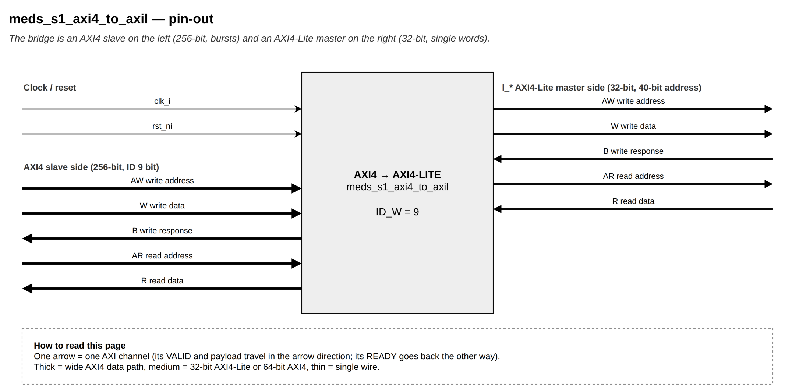
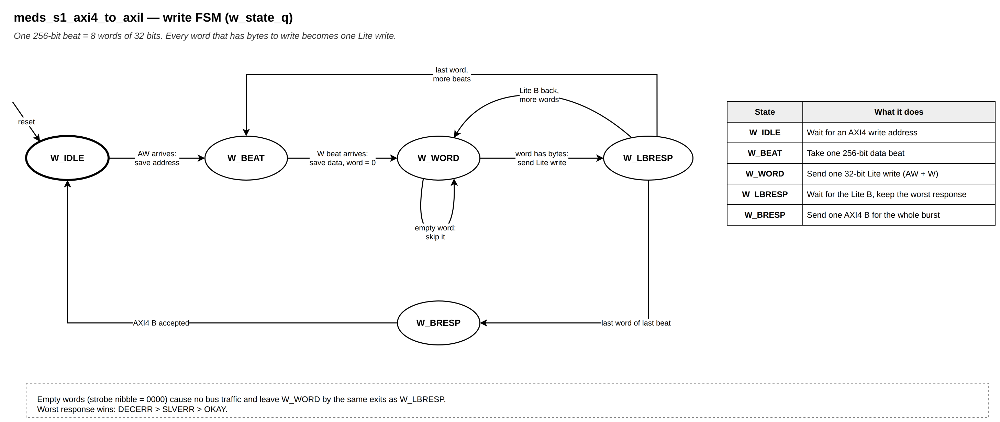
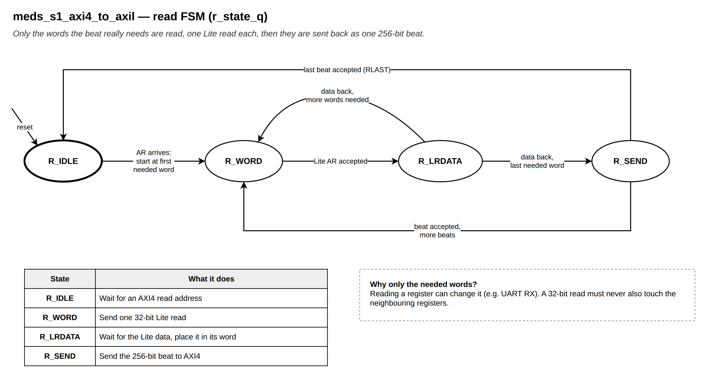

# `meds_s1_axi4_to_axil`

| | |
|---|---|
| **Status** | COMPLETE |
| **Owner** | @EmanMaqsood5 |
| **Backup** | _(assign)_ |
| **Project** | T-04 (fabric) — peripheral path |
| **Spec** | SPEC §18.1, §20, §24 |
| **Source** | `rtl/fabric/meds_s1_axi4_to_axil.sv` |
| **Testbench** | covered end-to-end through `verif/unit/tb_meds_s1_axil_periph_subtree.sv` |

## Purpose

Converts a 256-bit, burst-capable AXI4 slave port into a 32-bit AXI4-Lite master port. It is used
in two places: the peripheral subtree's bridge (`meds_s1_axil_periph_subtree`) and, separately,
each accelerator socket's `cfg_axil` config window.

Every AXI4 beat is walked word by word: a write turns each non-zero 32-bit strobe nibble into one
Lite write (so a 64-bit store becomes two Lite writes, dropping no bytes); a read issues one Lite
read per 32-bit word the beat actually covers, so a narrow read never touches neighbouring
registers (important for read-sensitive registers such as a UART's RX FIFO). Bursts are walked
beat by beat with `axi_next_addr()`. The AXI4 B response and each R beat carry the worst Lite
response seen (DECERR > SLVERR > OKAY).

## Interface contract

| Signal | Dir | Width | Meaning | Contract |
|---|---|---|---|---|
| `clk_i`, `rst_ni` | | 1 | clock, reset | async assert, sync de-assert |
| `aw*`, `w*`, `b*`, `ar*`, `r*` | | | AXI4 slave port | 256-bit data, `ID_W`-bit ID (default `AXI_SID_W` = 9), bursts |
| `l_*` | | | AXI4-Lite master port | 32-bit data, 40-bit address (the full address, not a local offset) |

**Handshake:** Lite AW and W are driven together but handshaken independently, so a Lite slave may
accept them in any order or cycle — this module never waits for one before raising the other.
**Throughput:** one AXI4 transaction per direction at a time; each 32-bit word costs one Lite
round trip, so a wide burst becomes up to 32 Lite transactions per beat.
**Reset state:** idle, no AXI4 or Lite channel asserted.

## Parameters

| Parameter | Default | Legal range | Effect |
|---|---|---|---|
| `ID_W` | `AXI_SID_W` (9) | 1..16 | AXI4 ID width; set to the crossbar's slave-side ID width |

## Behaviour

Write: `W_IDLE` → `W_BEAT` (capture one AXI4 beat) → `W_WORD` (walk 8 words; a zero strobe nibble
is skipped with no Lite traffic) → `W_LBRESP` (wait for the Lite B, merge the worst response) →
back to `W_WORD` for the next word, `W_BEAT` for the next beat, or `W_BRESP` (send one AXI4 B for
the whole burst) after the last word of the last beat.

Read: `R_IDLE` → `R_WORD` (only the words the beat's `[addr, aligned+2^size)` byte range actually
needs — `r_last_word` selects the top word) → `R_LRDATA` (wait for Lite data, place it in that
word of the beat) → next word, or `R_SEND` (return the assembled 256-bit beat) → next beat or
`R_IDLE`.

## Exceptions and errors

No response of its own; it forwards the worst Lite response (DECERR > SLVERR > OKAY) as the AXI4
B response and each R beat's response.

## Verification status

| Layer | Status | Where |
|---|---|---|
| Lint | clean, all four configs (`make lint`) | |
| Unit test | 3933 checks (shared with the subtree, below) | `verif/unit/tb_meds_s1_axil_periph_subtree.sv` |
| Co-simulation | not applicable | |
| Formal | not yet | |

Exercised through `meds_s1_axil_periph_subtree`'s testbench: a 64-bit CLINT access split into two
Lite writes, a 4-beat 256-bit burst, byte/half stores at odd offsets, a WRAP burst, a check that a
32-bit read issues exactly one Lite read, SLVERR propagation from a Lite slave, and 120 randomised
transfers checked byte-by-byte.

## Known limitations

Only one AXI4 transaction per direction at a time (no outstanding). WLAST is carried but not
checked — the last beat is found by counting `AWLEN + 1` beats instead (see
`verif/verilator.vlt` for the same reasoning already used in `meds_s1_axi4_b_ch`).

## Open questions

None.
