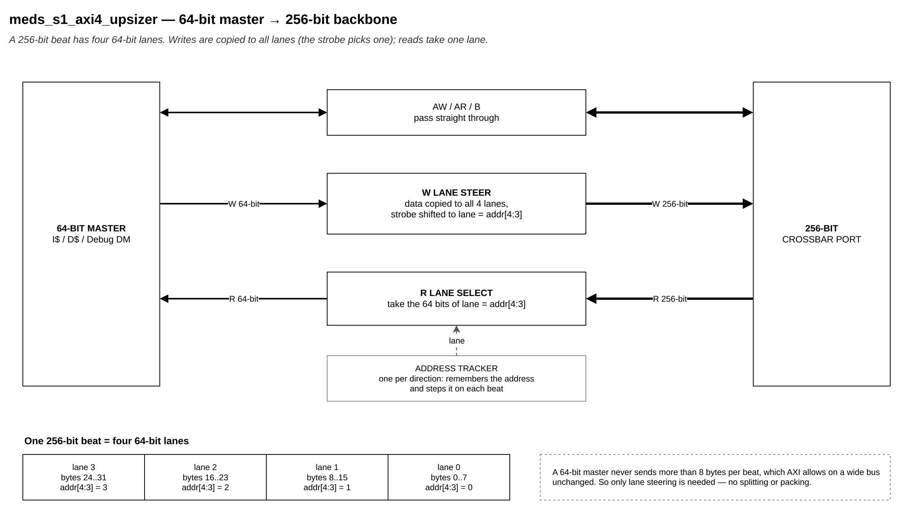
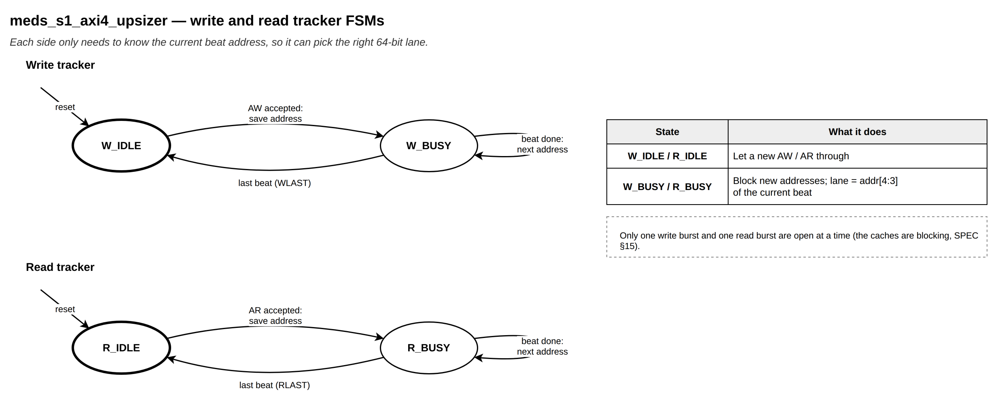

# `meds_s1_axi4_upsizer`

| | |
|---|---|
| **Status** | COMPLETE |
| **Owner** | @EmanMaqsood5 |
| **Backup** | _(assign)_ |
| **Project** | T-04 (fabric) — width conversion |
| **Spec** | SPEC §15, §18.1 |
| **Source** | `rtl/fabric/meds_s1_axi4_upsizer.sv` |
| **Testbench** | `verif/unit/tb_meds_s1_axi4_upsizer.sv` |

## Purpose

Connects a 64-bit AXI4 master (I$, D$, Debug DM) to the 256-bit backbone. A 64-bit master never
issues a transfer bigger than 8 bytes, and AXI4 allows such narrow transfers on a wide bus
unchanged — so address and response channels pass straight through, and only the data channels
need steering: on a write, the 64-bit word is copied to all four 64-bit lanes and WSTRB is shifted
into the lane the beat address selects; on a read, that same lane is picked out of the 256-bit
word that comes back. The beat address is stepped with `axi_next_addr()`, so INCR, WRAP (cache
refill) and FIXED bursts all work.

## Interface contract

| Signal | Dir | Width | Meaning | Contract |
|---|---|---|---|---|
| `clk_i` | in | 1 | clock | single domain |
| `rst_ni` | in | 1 | reset | async assert, sync de-assert |
| `m_*` | | | 64-bit AXI4 slave port | from the narrow master; `NARROW_DATA_W` = 64 |
| `s_*` | | | 256-bit AXI4 master port | to the crossbar; `AXI_DATA_W` = 256 |

**Handshake:** AW, AR and B pass through unmodified (VALID/READY forwarded 1:1). W and R are
re-shaped combinationally; their handshakes also pass through unmodified.
**Latency:** zero extra cycles — this is a wiring/muxing module, not a buffering one.
**Backpressure:** whatever the crossbar port applies is seen unchanged by the narrow master.
**Reset state:** no state to reset other than the address trackers below.

## Parameters

None beyond the widths already fixed in `meds_s1_axi4_pkg` (`AXI_ID_W`, `AXI_ADDR_W`,
`NARROW_DATA_W`, `AXI_DATA_W`).

## Behaviour

Two independent trackers, one per direction, each two states:

- **`W_IDLE` → `W_BUSY`** on an accepted AW: captures the burst's starting address, size and burst
  type. In `W_BUSY`, `w_addr_q[4:3]` selects the write lane for the current beat and is stepped
  with `axi_next_addr()` on every accepted W beat; back to `W_IDLE` on `WLAST`.
- **`R_IDLE` → `R_BUSY`** on an accepted AR: same idea, `r_addr_q[4:3]` selects the read lane and
  steps on every accepted R beat; back to `R_IDLE` on `RLAST`.

One write burst and one read burst are tracked at a time, which matches the blocking caches this
module sits behind (SPEC §15).

## Exceptions and errors

None — this module does not generate or inspect responses; SLVERR/DECERR come from whatever is
behind the crossbar.

## Verification status

| Layer | Status | Where |
|---|---|---|
| Lint | clean, all four configs (`make lint`) | |
| Unit test | see PR — random + directed, byte-level reference model | `verif/unit/tb_meds_s1_axi4_upsizer.sv` |
| Co-simulation | not applicable | |
| Formal | not yet | |

The testbench drives a 64-bit master against the upsizer and a 256-bit memory model, and checks:
an 8-beat INCR cache-line fill, an 8-beat WRAP refill (critical-word-first), a narrow store at
each of the four lanes (byte/half/word/doubleword), and 150 randomised transfers (random size,
burst type, length, address) — all checked byte-by-byte against an independent reference model.
A handshake checker (`tb_hs_chk`) also confirms VALID and the payload stay stable on the wide
side until READY.

## Known limitations

One outstanding burst per direction (matches the blocking caches it serves; not meant for an
out-of-order master).

## Open questions

None.
