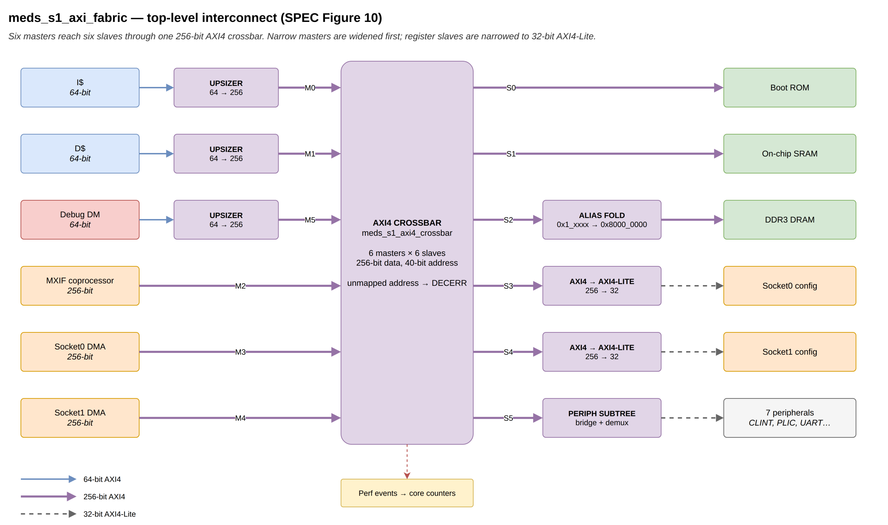

# `meds_s1_axi_fabric`

| | |
|---|---|
| **Status** | COMPLETE |
| **Owner** | @EmanMaqsood5 |
| **Backup** | _(assign)_ |
| **Project** | T-04 (fabric) — top level |
| **Spec** | SPEC §12, §15, §18 (Figure 10), §18.4, §20, §24, Appendix B |
| **Source** | `rtl/fabric/meds_s1_axi_fabric.sv` |
| **Testbench** | `verif/unit/tb_meds_s1_axi_fabric.sv` |

## Purpose

The complete MEDS-S1 bus fabric (SPEC §18, Figure 10) — every module in this project's series
wired together:

```
narrow masters (64-bit) --[upsizer]--+
  n[0] I$, n[1] D$, n[2] Debug DM    |
wide masters (256-bit) --------------+--> AXI4 crossbar --+--> mem[0] Boot ROM (AXI4)
  w[0] MXIF coproc,                                       +--> mem[1] SRAM     (AXI4)
  w[1] Socket0 DMA, w[2] Socket1 DMA                       +--> mem[2] DRAM/MIG (AXI4)
                                                            +--> [to_axil] --> sk[0] Socket0 cfg_axil
                                                            +--> [to_axil] --> sk[1] Socket1 cfg_axil
                                                            +--> [periph subtree] --> p[0..6]
```

Three narrow 64-bit masters go through their own `meds_s1_axi4_upsizer` on the way in. Three wide
256-bit masters connect straight to the crossbar. On the way out: Boot ROM, SRAM and DRAM are
plain AXI4 pass-through (this module folds the DRAM uncached alias, SPEC §18.4, onto `DRAM_BASE`
here, so the DRAM controller itself needs no knowledge of the alias); the two accelerator socket
config windows each get their own `meds_s1_axi4_to_axil` bridge straight to a Lite slave; and the
seven platform peripherals sit behind `meds_s1_axil_periph_subtree`.

Memory slaves see `AXI_SID_W`-wide IDs and must echo them back unchanged. Socket cfg and
peripheral ports are 32-bit AXI4-Lite with the full 40-bit address.



## Interface contract

| Signal | Dir | Width | Meaning | Contract |
|---|---|---|---|---|
| `clk_i`, `rst_ni` | | 1 | clock, reset | async assert, sync de-assert |
| `n_*` | | | 3 narrow AXI4 masters (I$, D$, Debug DM) | 64-bit, through `meds_s1_axi4_upsizer` |
| `w_*` | | | 3 wide AXI4 masters (MXIF, Socket0 DMA, Socket1 DMA) | 256-bit, straight to the crossbar |
| `mem_*` | | | 3 AXI4 memory slaves (Boot ROM, SRAM, DRAM) | 256-bit, `AXI_SID_W`-bit ID, echoed unchanged |
| `sk_*` | | | 2 AXI4-Lite socket config slaves | full 40-bit address |
| `p_*` | | | `NUM_PERIPH` AXI4-Lite peripheral slaves | full 40-bit address |
| `evt_axi_*` | out | | performance events | passed straight through from the crossbar |

See each sub-module's own page for its handshake, throughput and reset contract; this module adds
no timing behaviour of its own beyond wiring and the DRAM address fold.

## Parameters

None of its own; every width and count (`NUM_PERIPH`, `AXI_SID_W`, `DRAM_BASE`, `DRAM_SIZE`, ...)
comes from `meds_s1_axi4_pkg`.

## Behaviour

Pure structural wiring — see the individual module pages (`meds_s1_axi4_upsizer`,
`meds_s1_axi4_crossbar`, `meds_s1_rr_arbiter`, `meds_s1_axi4_decerr_sink`, `meds_s1_axi4_to_axil`,
`meds_s1_axil_demux`, `meds_s1_axil_periph_subtree`) for each piece's own FSM behaviour. The one
piece of logic that lives directly in this module is the DRAM alias fold: any address the
uncached-alias region maps is rewritten as `DRAM_BASE | (a & (DRAM_SIZE - 1))` before it reaches
`mem_awaddr_o[SLV_DRAM]` / `mem_araddr_o[SLV_DRAM]`.

## Exceptions and errors

Whatever the crossbar and its slaves produce; see `meds_s1_axi4_crossbar.md` and
`meds_s1_axi4_decerr_sink.md`.

## Verification status

| Layer | Status | Where |
|---|---|---|
| Lint | clean, all four configs (`make lint`) | |
| Unit test | 29 checks, end to end | `verif/unit/tb_meds_s1_axi_fabric.sv` |
| Co-simulation | not applicable | |
| Formal | not yet | |

Seven directed scenarios plus one concurrent stress test: D$ writes a 64-byte line (INCR), I$
refills it with a WRAP burst starting mid-line and checks every word lands in the right rotated
position; a DMA writes through the uncached alias and D$ reads the same data back through the
cached address, with an explicit check that the DRAM model only ever saw folded (in-range)
addresses; D$ does a 64-bit store/load to CLINT `mtimecmp` and a byte store to UART, checking the
Lite address the peripheral subtree actually used; Debug DM programs an accelerator socket's
config registers and reads back what it wrote; I$ fetches from the Debug ROM window and the fetch
is confirmed to reach the Debug-Module peripheral port; an unmapped MXIF access returns DECERR
with the right beat count; and finally all three wide masters plus a repeating D$ store/load loop
run concurrently against stalled slave models, each checked against an independent scoreboard,
with the DRAM-only-sees-folded-addresses check repeated under contention.

## Known limitations

Inherits the outstanding-transaction limits of `meds_s1_axi4_crossbar` and the one-burst-at-a-time
limits of the upsizer and the peripheral-path bridge.

## Open questions

None.
