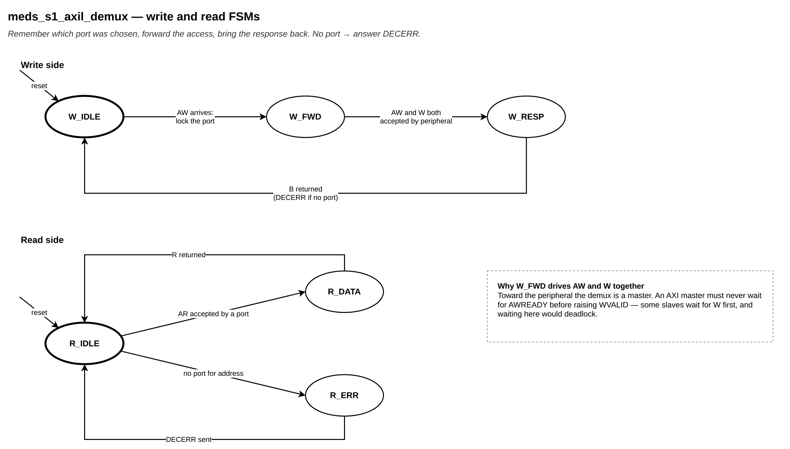

# `meds_s1_axil_demux`

| | |
|---|---|
| **Status** | COMPLETE |
| **Owner** | @EmanMaqsood5 |
| **Backup** | _(assign)_ |
| **Project** | T-04 (fabric) — peripheral path |
| **Spec** | SPEC §24, Appendix B |
| **Source** | `rtl/fabric/meds_s1_axil_demux.sv` |
| **Testbench** | covered end-to-end through `verif/unit/tb_meds_s1_axil_periph_subtree.sv` |

## Purpose

Routes one AXI4-Lite master to one of `N` AXI4-Lite slave ports. It holds no address map of its
own — the parent module (`meds_s1_axil_periph_subtree`) supplies the decode (`aw_hit_i`/`aw_sel_i`
from the current AWADDR, `ar_hit_i`/`ar_sel_i` from ARADDR) each time a new address is presented.
An address with no matching port is answered locally with DECERR, without ever reaching a
peripheral.

## Interface contract

| Signal | Dir | Width | Meaning | Contract |
|---|---|---|---|---|
| `clk_i`, `rst_ni` | | 1 | clock, reset | async assert, sync de-assert |
| `aw_hit_i`, `aw_sel_i` | in | 1, `SW` | decode for the address currently on AWADDR | valid whenever AWVALID is |
| `ar_hit_i`, `ar_sel_i` | in | 1, `SW` | decode for the address currently on ARADDR | valid whenever ARVALID is |
| `aw*`, `w*`, `b*`, `ar*`, `r*` (no prefix) | | | upstream AXI4-Lite slave port | from one Lite master |
| `p_*` | | | `N` downstream AXI4-Lite master ports | one per peripheral |

**Handshake:** toward a peripheral, this module is itself a master — so it never waits for
AWREADY before raising WVALID (a peripheral is allowed to wait for W before taking AW; waiting
here for AWREADY first would deadlock against such a peripheral). AW and W are driven together and
handshaken independently.
**Throughput:** one write and one read transaction at a time (no bursts reach this module — the
subtree's bridge has already reduced everything to single 32-bit Lite transactions).
**Reset state:** idle, no upstream or downstream channel asserted.

## Parameters

| Parameter | Default | Legal range | Effect |
|---|---|---|---|
| `N` | `NUM_PERIPH` (7) | 1.. | number of downstream ports |
| `SW` | `PIDX_W` (3) | ⌈log₂ N⌉.. | width of `aw_sel_i` / `ar_sel_i` |

## Behaviour

Write: `W_IDLE` (latch the decode on AWVALID) → `W_FWD` (drive AW and W to the selected port
together, tracking each handshake separately so a peripheral that takes W before AW is handled
correctly) → `W_RESP` (return that port's B, or DECERR if the address had no port) → `W_IDLE`.

Read: forwards AR to the selected port (or answers DECERR itself if unmapped) and returns that
port's R.

## Exceptions and errors

DECERR for any address `aw_hit_i` / `ar_hit_i` reports as unmapped. No other error paths — a
selected peripheral's own response (OKAY/SLVERR) passes straight through.

## Verification status

| Layer | Status | Where |
|---|---|---|
| Lint | clean, all four configs (`make lint`) | |
| Unit test | 3933 checks (shared with the subtree) | `verif/unit/tb_meds_s1_axil_periph_subtree.sv` |
| Co-simulation | not applicable | |
| Formal | not yet | |

Exercised with all three AXI4-Lite AW/W acceptance orders across the seven peripheral ports
(`tb_axil_mem`'s `MODE` parameter cycles `i % 3` per port), a hole in the peripheral region
(DECERR), and a memory-mapped address whose slave itself returns SLVERR (confirming it propagates
unchanged).

## Known limitations

No bursts — by design, since everything reaching this module is already a single-beat Lite
transaction.

## Open questions

None.
