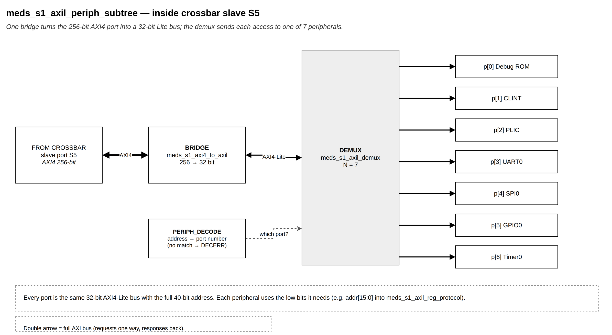
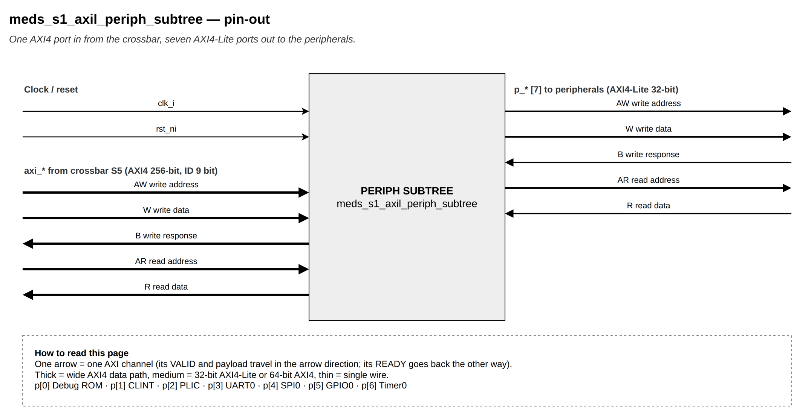

# `meds_s1_axil_periph_subtree`

| | |
|---|---|
| **Status** | COMPLETE |
| **Owner** | @EmanMaqsood5 |
| **Backup** | _(assign)_ |
| **Project** | T-04 (fabric) — peripheral path |
| **Spec** | SPEC §18.1, §24, Appendix B |
| **Source** | `rtl/fabric/meds_s1_axil_periph_subtree.sv` |
| **Testbench** | `verif/unit/tb_meds_s1_axil_periph_subtree.sv` |

## Purpose

The crossbar's `SLV_PERIPH` slave: one 256-bit AXI4 port in, one 32-bit AXI4-Lite port per
peripheral out. It is `meds_s1_axi4_to_axil` (width/burst conversion) feeding
`meds_s1_axil_demux` (address routing), with the address decode for the demux computed here from
`meds_s1_axi4_pkg::periph_decode()` — this module carries no map of its own beyond calling that
function.

| Region | Base | Size |
|---|---|---|
| Debug Module ROM / scratch | `0x0000_0000` | 4 KB |
| CLINT | `0x0200_0000` | 64 KB |
| PLIC | `0x0C00_0000` | 4 MB |
| UART0 | `0x1000_0000` | 4 KB |
| SPI0 | `0x1000_1000` | 4 KB |
| GPIO0 | `0x1000_2000` | 4 KB |
| Timer0 | `0x1000_3000` | 4 KB |

Anything else in the peripheral region returns DECERR.

## Interface contract

| Signal | Dir | Width | Meaning | Contract |
|---|---|---|---|---|
| `clk_i`, `rst_ni` | | 1 | clock, reset | async assert, sync de-assert |
| `axi_*` | | | AXI4 slave port (crossbar slot `SLV_PERIPH`) | 256-bit, `AXI_SID_W`-bit ID, bursts |
| `p_*` | | | `NUM_PERIPH` AXI4-Lite master ports, one per peripheral | full 40-bit address; a peripheral uses the low bits it needs |

**Handshake, throughput, reset:** inherited from the two modules inside — see
`meds_s1_axi4_to_axil.md` and `meds_s1_axil_demux.md`.

## Parameters

None of its own; `meds_s1_axi4_to_axil` and `meds_s1_axil_demux` are instantiated with
`AXI_SID_W`, `NUM_PERIPH` and `PIDX_W` from `meds_s1_axi4_pkg`.

## Behaviour

An AXI4 beat arrives at `meds_s1_axi4_to_axil`, which turns it into one or more 32-bit Lite
transactions (see that module's page for its write/read FSMs). Each Lite address is decoded with
`periph_decode()` and handed to `meds_s1_axil_demux`, which forwards it to the matching peripheral
port or answers DECERR if it falls in none of the seven windows above.

## Exceptions and errors

DECERR for any address outside all seven windows. SLVERR from a peripheral propagates unchanged
through both stages back to the AXI4 B/R response.

## Verification status

| Layer | Status | Where |
|---|---|---|
| Lint | clean, all four configs (`make lint`) | |
| Unit test | 3933 checks | `verif/unit/tb_meds_s1_axil_periph_subtree.sv` |
| Co-simulation | not applicable | |
| Formal | not yet | |

The testbench checks: every peripheral window is reached by exactly one write, a 64-bit CLINT
`mtimecmp` access splits into exactly two Lite writes, a 4-beat 256-bit burst to PLIC, byte/half
stores at odd offsets (UART, SPI), a WRAP burst to GPIO, that a 32-bit read issues exactly one
Lite read, DECERR for a hole in the peripheral region, SLVERR propagation on both B and R, a burst
immediately followed by another write (regression for an old bridge bug that left a beat behind),
and 120 randomised transfers across all seven peripherals checked byte-by-byte against an
independent reference model. A handshake checker on every Lite port confirms VALID and payload
stay stable until READY throughout.

## Known limitations

One AXI4 transaction per direction at a time (inherited from `meds_s1_axi4_to_axil`).

## Open questions

None.
