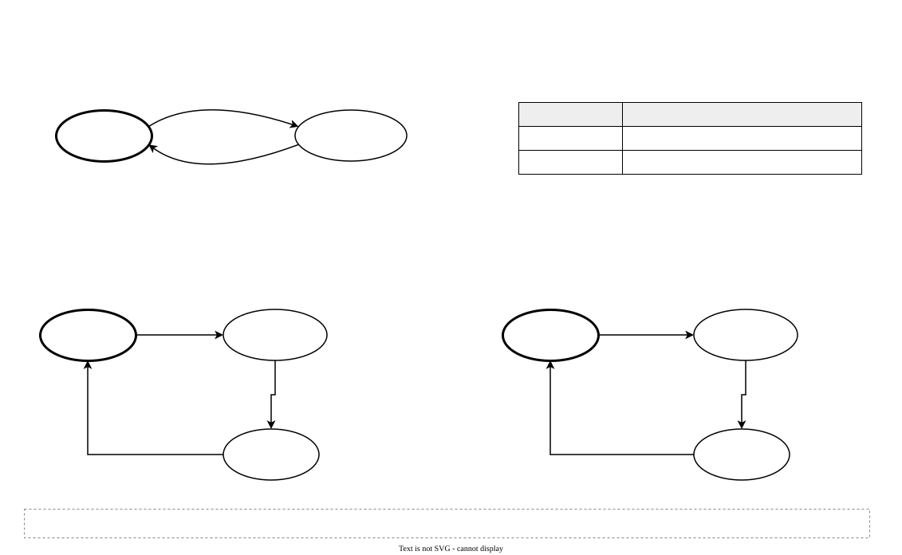

# `meds_s1_axil_reg_protocol`

| | |
|---|---|
| **Status** | COMPLETE |
| **Owner** | @EmanMaqsood5 |
| **Backup** | _(assign)_ |
| **Project** | T-04 (fabric) — shared register shell |
| **Spec** | SPEC §18, §20.2, §24; AXI IHI0022 |
| **Source** | `rtl/common/meds_s1_axil_reg_protocol.sv` |
| **Testbench** | `verif/unit/tb_meds_s1_axil_reg_protocol.sv` |
## Purpose

A generic AXI4-Lite slave shell. It speaks AXI4-Lite on one side and a plain register interface on
the other, so a peripheral or an accelerator's `cfg_axil` window only has to implement "write this
register" and "read this register" — never a handshake. It exists as a separate module so every
Lite slave in the platform (CLINT, PLIC, UART, SPI, GPIO, Timer, accelerator config) answers the
bus in exactly the same way.

Internally it is five small modules, one per AXI channel:
`meds_s1_axil_aw_ch`, `meds_s1_axil_w_ch` and `meds_s1_axil_ar_ch` each capture one request;
`meds_s1_axil_b_ch` performs the write and answers B; `meds_s1_axil_r_ch` performs the read and
answers R.

## Interface contract

| Signal | Dir | Width | Meaning | Contract |
|---|---|---|---|---|
| `clk_i` | in | 1 | clock | single domain |
| `rst_ni` | in | 1 | reset | async assert, sync de-assert |
| `aw*`, `w*`, `b*`, `ar*`, `r*` | | | AXI4-Lite slave port | `ADDR_WIDTH`-bit local address, 32-bit data |
| `wr_addr_o`, `wr_data_o`, `wr_strb_o` | out | | write port | stable while `wr_en_o` is high |
| `wr_en_o` | out | 1 | write strobe | exactly one pulse per write transaction |
| `wr_addr_valid_i` | in | 1 | offset implemented? | sampled with `wr_en_o`; 0 → SLVERR |
| `rd_addr_o` | out | `ADDR_WIDTH` | read address | |
| `rd_data_i`, `rd_addr_valid_i` | in | 32, 1 | read result | **combinational** from `rd_addr_o`; 0 → SLVERR |

**Handshake:** READY never waits for VALID — each capture module raises its READY whenever it is
empty. AW and W may arrive in either order or together.
**Latency:** B is valid three clock edges after the later of the AW and W handshakes; R is valid
three edges after the AR handshake (no wait states from the register block).
**Backpressure:** one write and one read are processed at a time. While B or R is waiting for
READY, the next AW / AR can already be captured.
**Reset state:** all READY and VALID outputs low except the capture modules' READY, which is high.

### Contract for the register block behind the shell

- Honour `wr_strb_o` byte by byte (SPEC P3: never write a byte that was not strobed).
- Drive `wr_addr_valid_i` / `rd_addr_valid_i` low for an offset you do not implement; the shell then
  answers SLVERR, which the core turns into an access fault.
- `rd_data_i` must be combinational from `rd_addr_o` (a one-cycle lookup).

## Parameters

| Parameter | Default | Legal range | Effect |
|---|---|---|---|
| `ADDR_WIDTH` | `AXIL_LOCAL_ADDR_W` (16) | 2..40 | local offset width; connect the low bits of the 40-bit Lite address |
| `DATA_WIDTH` | `AXIL_DATA_W` (32) | 32 | Lite data width |
| `STRB_WIDTH` | `DATA_WIDTH / 8` | derived | do not override |

## Behaviour

Capture modules: IDLE (READY high) → CAPTURED on VALID → back to IDLE when B_CH / R_CH consumes the
request. B_CH: IDLE → COMMIT (AW and W both captured) → RESP (pulse `wr_en_o`, choose OKAY/SLVERR)
→ IDLE when BREADY. R_CH: IDLE → LOOKUP (AR captured) → RESP (register `rd_data_i`, choose
OKAY/SLVERR) → IDLE when RREADY.

## Exceptions and errors

SLVERR when the register block reports the offset as not implemented. The shell never produces
DECERR — that is the decoder's job (demux or crossbar).

## Verification status

| Layer | Status | Where |
|---|---|---|
| Lint | clean, all four configs (`make lint`) | |
| Unit test | 408 checks | `verif/unit/tb_meds_s1_axil_reg_protocol.sv` |
| Co-simulation | not applicable | |
| Formal | not yet | |

The testbench puts a 15-register file behind the shell and checks strobes, SLVERR on unmapped
offsets, W-before-AW and AW-before-W ordering, and a 400-transaction random run against a
scoreboard.

## Known limitations

- One outstanding write and one outstanding read. Fine for register slaves; not meant for memory.
- `AxPROT` is not carried (see the fabric README: protection is enforced in the core, SPEC §11).

## Open questions

None.
