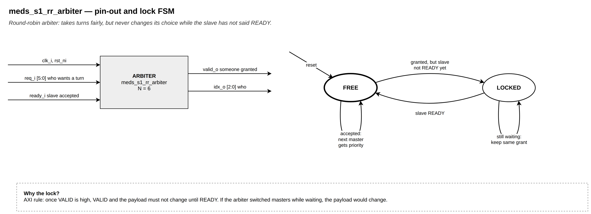

# `meds_s1_rr_arbiter`

| | |
|---|---|
| **Status** | COMPLETE |
| **Owner** | @EmanMaqsood5 |
| **Backup** | _(assign)_ |
| **Project** | T-04 (fabric) — crossbar |
| **Spec** | AXI IHI0022 A3.2.1 |
| **Source** | `rtl/fabric/meds_s1_rr_arbiter.sv` |
| **Testbench** | covered end-to-end through `verif/unit/tb_meds_s1_axi4_crossbar.sv` |

## Purpose

Round-robin arbiter for one AXI address channel — used once per slave for AW and once per slave
for AR inside `meds_s1_axi4_crossbar`. AXI requires that once VALID is high, VALID and the payload
must stay unchanged until READY (IHI0022 A3.2.1), so when a granted request isn't accepted in a
cycle, the grant is locked to that requester until it is. After an accepted grant, priority rotates
to the requester after it.

## Interface contract

| Signal | Dir | Width | Meaning | Contract |
|---|---|---|---|---|
| `clk_i`, `rst_ni` | | 1 | clock, reset | async assert, sync de-assert |
| `req_i` | in | `N` | one bit per requester | combinational, may change every cycle while `!valid_o` |
| `ready_i` | in | 1 | downstream READY for the currently granted request | |
| `valid_o` | out | 1 | a request is granted this cycle | |
| `idx_o` | out | `IW` | index of the granted requester | held stable while `valid_o && !ready_i` |

**Handshake:** `idx_o` is guaranteed stable across cycles where `valid_o` stays high and `ready_i`
stays low — this is the entire point of the module.
**Reset state:** no lock, full-round mask (every requester eligible).

## Parameters

| Parameter | Default | Legal range | Effect |
|---|---|---|---|
| `N` | 6 | 1.. | number of requesters |
| `IW` | `$clog2(N)` (or 1 if `N` = 1) | derived | width of `idx_o` |

## Behaviour

FREE → LOCKED when a grant is made but the slave hasn't said READY yet; LOCKED → FREE (with
priority rotated past the just-served requester) on READY; LOCKED → LOCKED while still waiting.
In FREE, the pick is the first requester at or after a rotating mask position, wrapping to the
first requester overall if none are at or after it.

## Exceptions and errors

None.

## Verification status

| Layer | Status | Where |
|---|---|---|
| Lint | clean, all four configs (`make lint`) | |
| Unit test | exercised as 12 instances (one per slave per channel) inside the crossbar testbench | `verif/unit/tb_meds_s1_axi4_crossbar.sv` |
| Co-simulation | not applicable | |
| Formal | not yet | |

Not tested in isolation; the crossbar testbench's T3/T4/T5 groups exercise contention, locked
grants under backpressure, and round-robin fairness across 6 masters directly.

## Known limitations

None.

## Open questions

None.
